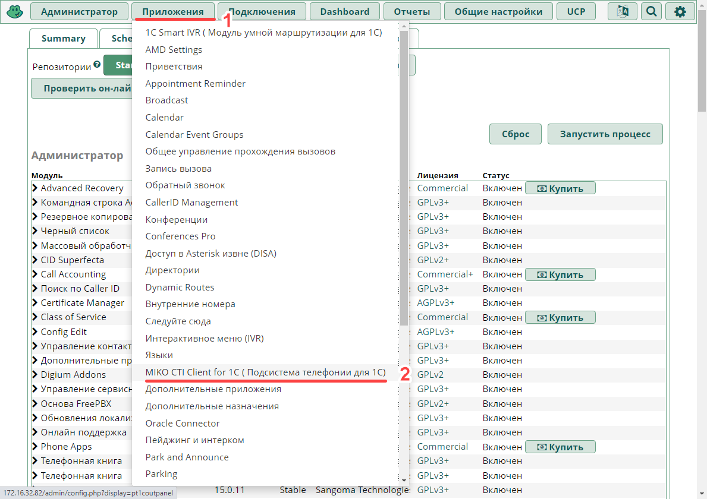
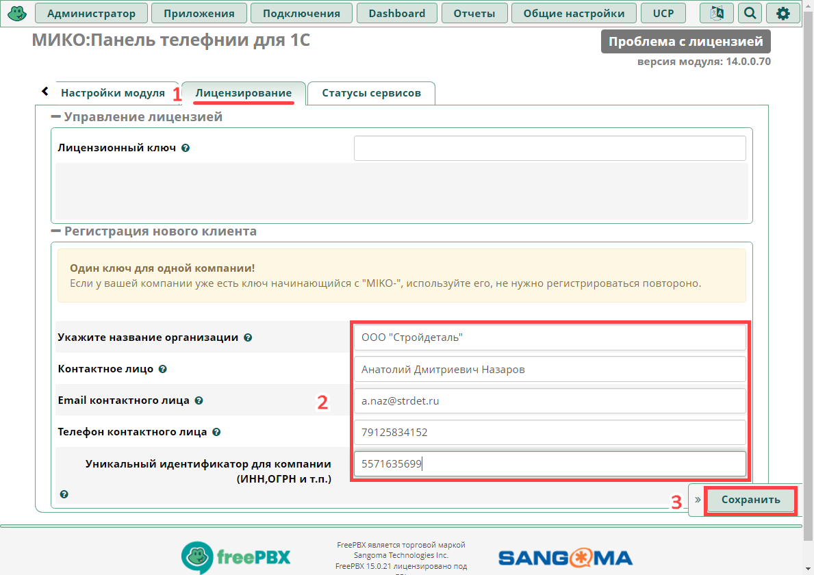
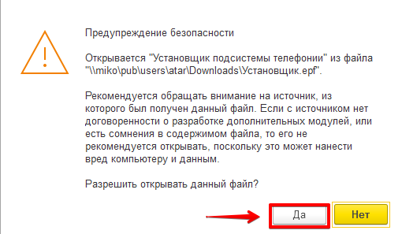
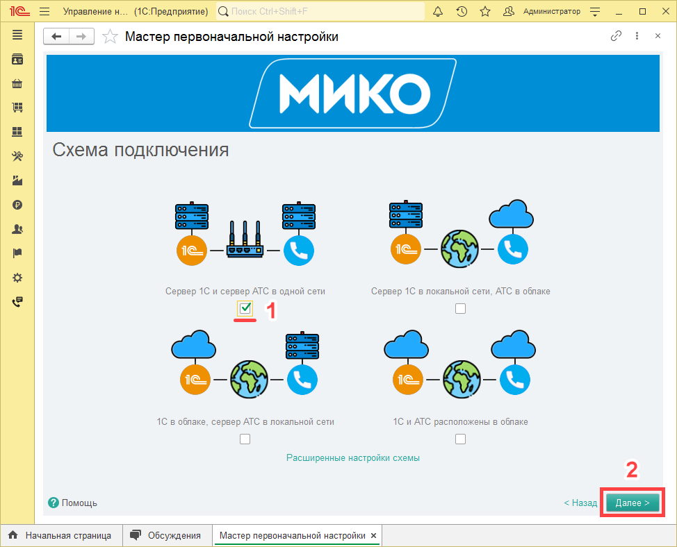

# Интеграция с FreePBX

!!! info
Данное руководство предполагает наличие навыков настройки АТС и работы с конфигуратором 1С. 
Для выполнения некоторых инструкций могут потребоваться права администратора. 
На сегодняшний момент поддерживается только **FreePBX 15 (Asterisk 16)**.
!!!

Данная инструкция предназначена для подсистемы телефонии редакции 2.2. Для предыдущих версий используйте другую инструкцию.

### Установка модуля на АТС

Суть работы модуля заключается в подключении к AMI интерфейсу Asterisk, сбору информации о звонках, состоянии каналов, а также взаимодействие с 1С:Предприятием и Панелью телефонии для управления вызовами.

На текущий момент протестирована работа модуля на следующих версиях FreePBX/Asterisk

FreePBX 15.0.17.12 / Asterisk 16.6.2,  
FreePBX 14.0.13.34 / Asterisk 16.15.1

Перейдите в веб-интерфейс АТС, выберите раздел **FreePBX Administration**.


Выполните **Admin -> Module Admin**.


Выполните **Upload modules**.


Выберите **Type** выберите **Download (From Web)**. 
Скопируйте ссылку на последнюю версию модуля "Панель телефонии 2.0 для 1С":   
```html
https://releases.mikopbx.com/releases/v1/freepbx/getModuleFile/pt1coutpanel/latest.tgz
```
Вставьте ее в поле **Download Remote Module**.  
Выполните **Download (From Web)**.


Дождитесь загрузки модуля на АТС. Затем выполните **Manage Local Modules**.


В разделе **Appliations** найдите модуль **MIKO CTI Client 4.0**, нажмите **Install**.


Прокрутите страницу с модулями в самый низ и выполните **Process**.


После установки модуля выполните **Confirm**.


В появившемся окне **Status** выполните **Return**.


Приметите изменения. Для этого выполните **Apply Config**.


После этого в разделе **Applications** появится команда **MIKO CTI Client 4.0 for 1C (Подсистема телефонии для 1С)**. Выполните ее.


В открывшемcя модуле перейдите на вкладку **Лицензирование**.
Если вы не имеете лицензионного ключа, заполните поля раздела **Регистрация нового клиента**.  


!!!info Лицензионный ключ
Ключ имеет формат **MIKO-XXXXX-XXXXX-XXXXX-XXXXX** и отправляется автоматически после регистрации
на ваш email с адреса lic@miko.ru. У ключа будет активирован триальный период на **30-дней** на продукты: "Панель телефонии для 1С", "Журнал звонков и аналитика".
!!!

Если у вас уже есть лицензионный ключ, вставьте его в поле **Лицензионный ключ**.


Перейдите на вкладку **Настройки модуля**. В разделе **Общие настройки** установите переключатель в положение **Автоматическая настройка модуля**.  
В разделе **Прочие настройки** переключатель **Включить режим отладки модуля** установите в положение **Включить**. Выполните **Submit**.


Скачайте расширение для 1С, нажав на ссылку.


### Встраивание расширения телефонии в информационную базу 1С:Предприятие
Запустите информационную базу 1С в режиме "1С:Предприятие". Войдите пользователем, имеющим права администратора.
В главном меню выполните  Файл - > Открыть (или нажмите комбинацию клавиш **Ctrl+O**).  Выберите скачанную обработку **Установщик.epf**


Согласитесь в появившемся предупреждении безопасности.


На странице **Проверка доступных лицензий** вставьте ваш лицензионный ключ в одноименное поле и выполните **Далее**.


Выберите последнюю версию расширения, если их несколько и выполните **Установить**.


Ознакомьтесь с лицензионным соглашением и примите условия.


Начнется установка расширения. После окончания установки перезагрузите информационную базу, нажав на кнопку **Перезагрузить**.


После перезапуска базы в панели функций текущего раздела появится подсистема **Звонки и сообщения**. Также в открытых формах появится **Мастер первоначальной настройки**.


Перейдите в форму **Мастер первоначальной настройки** и выполните на ней **Далее**.


На странице **Схема подключения** выберите подходящую вам [!badge схему соединения](~/root-guides/select-connection-mode) АТС с 1С. Выбор приципиального значения не имеет - это, своего рода, подсказка. От него будет зависеть первоначальное заполнение каналов передачи событий и контактных данных.  
Откройте **Расширенные настройки** и установите их исходя из выбранной схемы подключения. Выполните **Далее**.  
В данном примере использовалась серверная информационная база, и выбран способ подключения Long-pooling.
!!! Коротко о способах подключения
Если у вас ==Сервер 1С== и пользователи подключаются посредством тонкого клиента - подойдет способ **Long-pooling**. Канал передачи контактных данных нужно установить в **Long-pooling соединение**, канал передачи событий в **Long-pooling соединение** или **Внешняя компонента**.  
Если у вас ==файловая информационная база== - подойдет способ **веб-сервис**. Нужно [!badge настроить публикацию](~/root-guides/base-publishing) информационной базы на сервере IIS или Apache, а каналы передачи событий и контактных данных установить в значение **веб-сервис**.  
!!!


В веб-интерфейсе АТС в модуле **МИКО:Панель телефонии 4.0** на вкладке **Настройка модуля** скопируйте код из раздела **Данные для автоматической настройки**.


На странице **Проверка связи** Переключатель **К какой АТС выполняется подключение** установите **FreePBX**.  
Переключатель **Настройка подключения** - в положение **Автоматическая настройка**. 
Ниже в поле вставьте скопированный ранее код автоматической настройки.
Выполните **Далее**.


Дождитесь установления соединения с АТС (около 30 с). 

Если в автоматическом режиме настроить соединение не удалось, можно его настроить в ручном режиме.  
Для этого в веб-интерфейсе АТС в модуле **МИКО:Панель телефонии 4.0** на вкладке **Настройка модуля** в разделе **Общие настройки** установите переключатель в положение **Ввести параметры подключения к 1С вручную**.  
В разделе **Связь с 1С:Предприятие 8** установите переключатель в соответствие с вашей [!badge схеме соединения](~/root-guides/select-connection-mode)
Скопируйте IP-адрес АТС и выполните **Submit**.


В мастере первоначальной настройки 1С переключатель **Настройка подключения** установите в положение **Ручная настройка**.  
В поле ниже вставьте адрес АТС и выполните **Далее**. Если соединение с АТС установится, мастер перейдет на следующую страницу.


На странице **Виды номеров** в поле **Вид внутреннего телефона** выберите **Телефон**.  
В поле **Вид мобильного телефона** выберите создание нового элемента. 


В появившейся форме создания вида контактной информации отметьте флажками поля **Запрещать ввод некорректных номеров** и **Вводить номер по маске**.
Ниже выберите маску **+7(999) 999-99-99**. Затем выполните **Записать и закрыть**.


После заполнения видов номеов перейдите на следующую страницу мастера, выполнив **Далее**.


На странице **Пользователи телефонии** присвойте пользователям информационной базы, которые будут использовать телефонию внутренние номера (лучше сразу заполнить и мобильные телефоны).
!!! Важно
Присваиваемые номера должны существовать на АТС.
!!!


Дождитесь окончания настройки. Страницу с мастером первоначальной настройки можно закрыть, она больше не понадобится. 


Перейдите к [установке Внешней панели 4.0](/user-guides/panel/install)