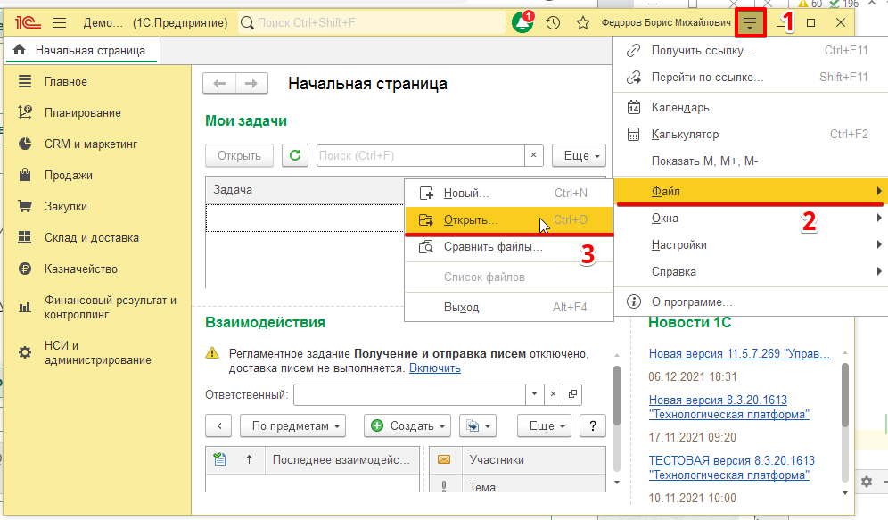
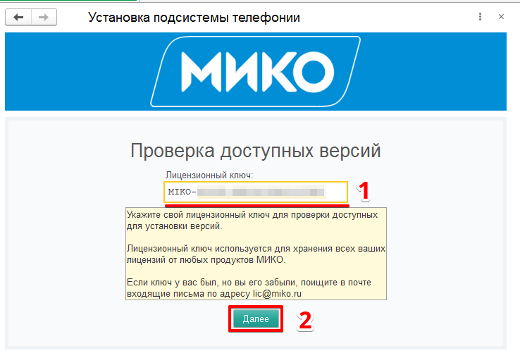
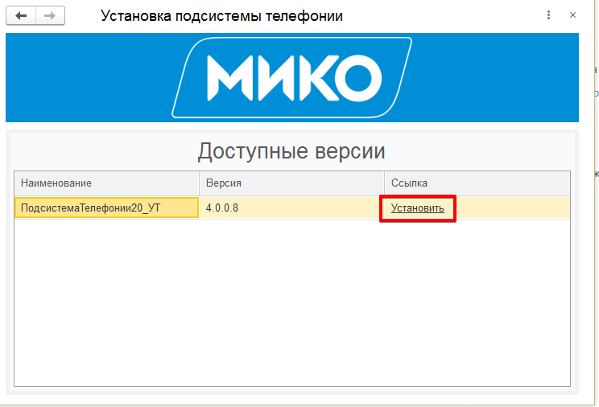
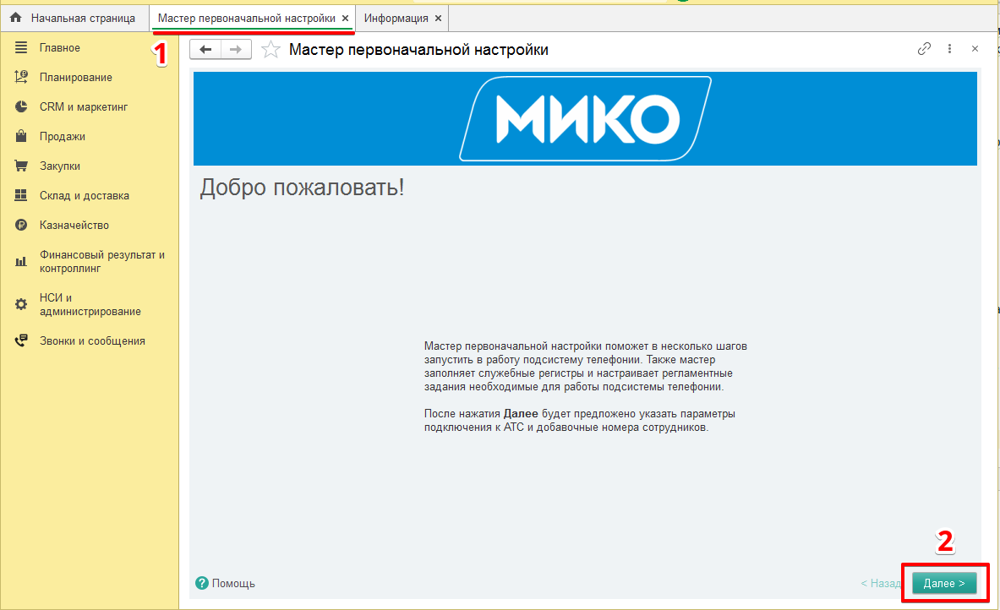
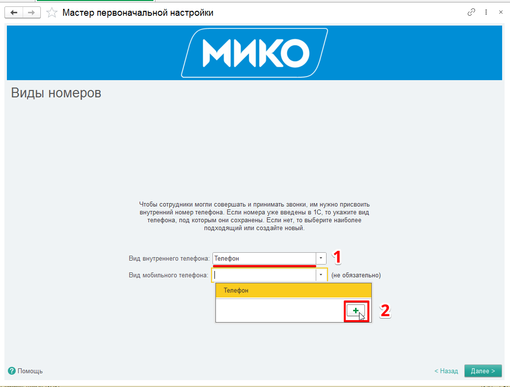
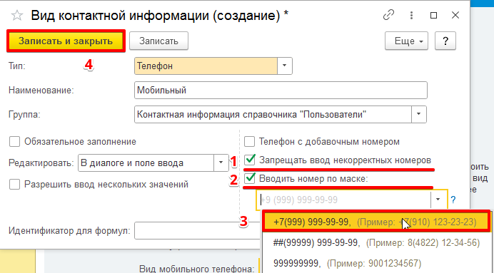
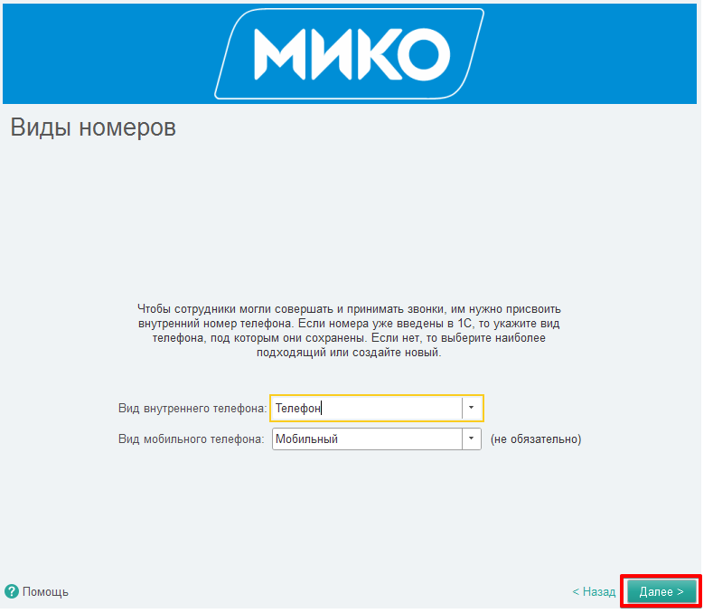

Данная инструкция предназначена для редакции 4.0, для предыдущих версий используйте [эту инструкцию](https://wiki.miko.ru/nightbird:v21:get-started-mango).  
Для интеграции виртуальной АТС Манго с 1С необходимо в личном кабинете подключить услугу «API коннектор» и сгенерировать уникальные ключи. После чего нужно установить и настроить сервер интеграции.  
## Установка сервера интеграции  
!!!
Необходимо наличие административного доступа к [личному кабинету Манго](https://lk.mango-office.ru) и подключенной в ВАТС услуги "**API коннектор**" . 
!!!
Сервер интеграции обеспечивает взаимосвязь между всеми компонентами панели телефонии. Он может быть установлен на терминальный сервер Windows, либо отдельный компьютер. Сервер интеграции устанавливается как служба Windows. Для установки требуются права администратора.  
### Вариант "А" - если вы еще не являетесь клиентом МИКО

 

В письме, пришедшем после заказа триала на `https://telefon.miko.ru/` скачайте архив с дистрибутивом по ссылке в письме: **Панель телефонии и Журнал звонков для 1С(ред.2)** → **Скачайте дистрибутив**.  

 
### Вариант "Б" - если вы уже клиент МИКО

 

1. Зайдите в [личный кабинет МИКО](https://telefon.miko.ru/personal/update-files).
2. Скачайте и распакуйте дистрибутив «**Панель телефонии и журнал звонков для 1С, редакция 2**».

### Продолжение - одинаковое для обоих вариантов
1. В скачанном архиве в папке «Интеграция с Манго» запустите файл «**Скачать сервер интеграции.url**».  
2. Выберите подходящий для разрядности вашей операционной системы сервер интеграции и скачайте его.  
3. Запустите мастер установки сервера интеграции. Следуйте указаниям мастера.  
4. По окончанию установки запустите службу сервера Nightbird, **Пуск** → **Nightbird сервер** → **Запустить сервер Nightbird**.

 

!!!
После запуска службы будут заняты **TCP** порты: **4222, 8000, 8222, 8223, 8224**. Для подключения к серверу интеграции с другого компьютера сети необходимо в брандмауэре открыть **TCP** порты **4222** и **8222**.
!!!

## Подключение к API ВАТС Манго
Сервер интеграции подключается к серверу API Манго. Для подключения необходимо получить код и ключ, уникальные для каждой ВАТС.

1. Зайдите в [личный кабинет Манго](https://lk.mango-office.ru) и выберите виртуальную АТС, с которой будет выполняться интеграция панели телефонии.  
2. Перейдите в раздел **Настройки АТС** → **Интеграции**. Выберите **API коннектор**.  

 

3. Нажмите кнопку "**Подключить API коннектор**".

 

4. Согласитесь с условиями и нажмите "**Подключить**".  

 

5. Откроется страница с настройками API. 
- Здесь указаны код и ключ для доступа к API.  
- Переключатель **Разрешенные IP-адреса** оставьте в положении "**Свободный доступ. Соединения по API возможны с любых IP-адресов**". Позже Вы сможете изменить эту настройку, когда убедитесь, что компоненты системы работают нормально.
- Установите флажок «**Предоставлять возможность генерации и использования ссылок**».
- Нажмите "**Сохранить**".

 

6. Запустите менеджер сервера интеграции, **Пуск** → **Nightbird сервер** → **Менеджер сервера**. Пароль администратора по умолчанию отсутствует. Если войти не удается, проверьте в службах Windows, запущена ли служба **MIKO.Nightbird.Monitor**.  
7. В разделе сервисов нажмите **Добавить**.  

 

8. Выберите сервис **MANGO OFFICE**. Вставьте уникальный код АТС и ключ для создания подписи в соответствующие поля.

 

9. Нажмите **Сохранить**.
10. Сервер интеграции должен установить соединение с АТС Манго. Об этом будет свидетельствовать статус "Ок".

 

11. Убедитесь, что у вас включена запись разговора внутри АТС. Перейдите: **Виртуальная АТС** → **Записи разговоров**.
Должно отображается имя кнопки «**ИЗМЕНИТЬ**» (а не «**ПОДКЛЮЧИТЬ**»), на вкладке «**Правила записи**» «**Записывать все звонки**»

 

Ниже приведен пример включения записи разговоров.

 

## Подключение к 1С
Связь с 1С обеспечит доступ к телефонной книге Вашей информационной базы для панели телефонии.

1. В менеджере сервера в разделе сервисов нажмите "**Добавить**".

 

2. Выберите сервис "**1С:Предприятие**".
3. Выберите [подходящий способ соединения с 1С.](http://localhost:5000/root-guides/select-connection-mode)

!!! Коротко о способах подключения
Если у вас ==Сервер 1С== и пользователи подключаются посредством тонкого клиента - подойдет способ **Long-pooling**. Канал передачи контактных данных нужно установить в **Long-pooling соединение**, канал передачи событий в **Long-pooling соединение** или **Внешняя компонента**.  
Если у вас ==файловая информационная база== - подойдет способ **веб-сервис**. Нужно [!badge настроить публикацию](~/root-guides/base-publishing) информационной базы на сервере IIS или Apache, а каналы передачи событий и контактных данных установить в значение **веб-сервис**.  
!!!

Для способа соединения «**веб-сервис**», заполните параметры подключения к веб-сервису.

 

При использовании **long-pool** соединения выполните данное подключение после настройки подсистемы 1С и выбора данного типа соединения в настройках.  Завершите настройку нажав "**Сохранить**".

 

На данном этапе[!badge variant="danger" text="соединение с 1С установлено не будет"]. Требуется дальнейшая настройка в 1С:Предприятие.

## Встраивание расширения телефонии в информационную базу 1С:Предприятие
1. Запустите информационную базу 1С в режиме "1С:Предприятие". Войдите пользователем, имеющим права администратора.
В главном меню выполните  Файл - > Открыть (или нажмите комбинацию клавиш **Ctrl+O**).   

Выберите обработку **Установщик.epf** из скачанного архива по пути `Подсистема телефонии для 1С\Редакция 2.2\Установщик.epf`  

 

2. Согласитесь в появившемся предупреждении безопасности.

3. На странице **Проверка доступных лицензий** вставьте ваш лицензионный ключ в одноименное поле и выполните **Далее**.

4. Выберите последнюю версию расширения, если их несколько и выполните **Установить**.

5. Ознакомьтесь с лицензионным соглашением и примите условия.

6. Начнется установка расширения. После окончания установки перезагрузите информационную базу, нажав на кнопку **Перезагрузить**.

7. После перезапуска базы в панели функций текущего раздела появится подсистема **Звонки и сообщения**. Также в открытых формах появится **Мастер первоначальной настройки**.

8. Перейдите в форму **Мастер первоначальной настройки** и выполните на ней **Далее**.

9. На странице **Схема подключения** выберите подходящую вам [!badge схему соединения](~/root-guides/select-connection-mode) АТС с 1С. Выбор принципиального значения не имеет - это, своего рода, подсказка. От него будет зависеть первоначальное заполнение каналов передачи событий и контактных данных.  
Откройте **Расширенные настройки** и установите их исходя из выбранной схемы подключения. Выполните **Далее**.  
В данном примере использовалась файловая информационная база, и выбран способ подключения веб-сервис.
!!! Коротко о способах подключения
Если у вас ==Сервер 1С== и пользователи подключаются посредством тонкого клиента - подойдет способ **Long-pooling**. Канал передачи контактных данных нужно установить в **Long-pooling соединение**, канал передачи событий в **Long-pooling соединение** или **Внешняя компонента**.  
Если у вас ==файловая информационная база== - подойдет способ **веб-сервис**. Нужно [!badge настроить публикацию](~/root-guides/base-publishing) информационной базы на сервере IIS или Apache, а каналы передачи событий и контактных данных установить в значение **веб-сервис**.  
!!!

 

10. Если вы не подключены к сервису 1С:Диалог, вам будет предложено это сделать. Введите адрес вашей электронной почты и в поле переключателя выберите "**1С:Диалог (рекомендуемый вариант)**". Нажмите "**Зарегистрироваться**".
!!!
Для работы телефонии это не является обязательным, чаты с коллегами без подключенных обсуждений работать не будут.
!!!

 

11. Вам на почту придет письмо с кодом. Скопируйте код.

 

12. Вставьте его в поле и нажмите "**Зарегистрироваться**".

 

13. После подключения обсуждений нажмите "**Готово**".

 

14. На странице "Проверка связи" выберите тип АТС "**Mango office**" IP-адрес сервера интеграции. Нажмите "**Далее**".

 

15. На странице **Виды номеров** в поле **Вид внутреннего телефона** выберите **Телефон**.  
В поле **Вид мобильного телефона** выберите создание нового элемента. 

16. В появившейся форме создания вида контактной информации отметьте флажками поля **Запрещать ввод некорректных номеров** и **Вводить номер по маске**.
Ниже выберите маску **+7(999) 999-99-99**. Затем выполните **Записать и закрыть**.

17. После заполнения видов номеров перейдите на следующую страницу мастера, выполнив **Далее**.

18. На странице **Пользователи телефонии** присвойте внутренние номера пользователям информационной базы, которые будут использовать телефонию (лучше сразу заполнить и мобильные телефоны).
!!! Важно
На ВАТС Манго должны существовать сотрудники с присваиваемыми номерами.
!!!

19. Дождитесь окончания настройки. Страницу с мастером первоначальной настройки можно закрыть, она больше не понадобится. 

20. Перейдите к [установке Внешней панели 4.0](/user-guides/panel/install)