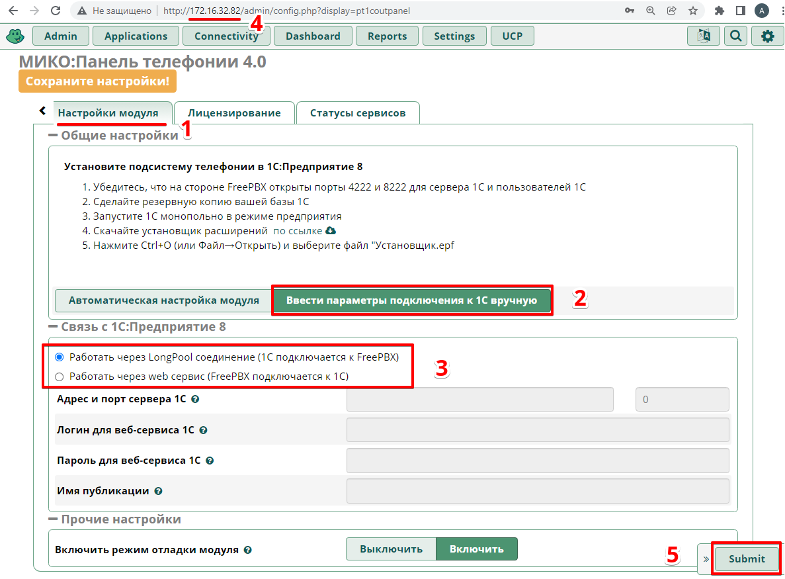
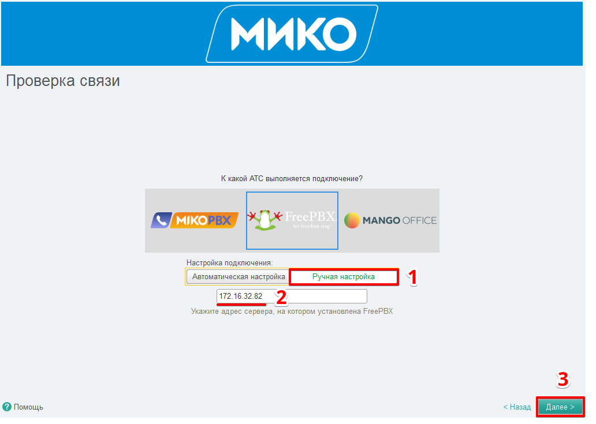

## Встраивание расширения телефонии в информационную базу 1С:Предприятие
1. Запустите информационную базу 1С в режиме "1С:Предприятие". Войдите пользователем, имеющим права администратора.
В главном меню выполните Файл - > Открыть (или нажмите комбинацию клавиш **Ctrl+O**).  

 

Выберите обработку **Установщик.epf** из скачанного архива по пути `Подсистема телефонии для 1С\Редакция 2.2\Установщик.epf`  

 

3. На странице **Проверка доступных лицензий** вставьте ваш лицензионный ключ в одноименное поле и выполните **Далее**.

 

4. Выберите последнюю версию расширения, если их несколько и выполните **Установить**.

5. Ознакомьтесь с лицензионным соглашением и примите условия.

 

6. Начнется установка расширения. После окончания установки перезагрузите информационную базу, нажав на кнопку **Перезагрузить**.

 

7. После перезапуска базы в панели функций текущего раздела появится подсистема **Звонки и сообщения**. Также в открытых формах появится **Мастер первоначальной настройки**.

 

8. Перейдите в форму **Мастер первоначальной настройки** и выполните на ней **Далее**.

 

9. На странице **Схема подключения** выберите подходящую вам [схему соединения](/root-guides/select-connection-mode) АТС с 1С. Выбор принципиального значения не имеет - это, своего рода, подсказка. От него будет зависеть первоначальное заполнение каналов передачи событий и контактных данных.  
Откройте **Расширенные настройки** и установите их исходя из выбранной схемы подключения. Выполните **Далее**.  
В данном примере использовалась файловая информационная база, и выбран способ подключения - через веб-сервис.

 

10. Если вы не подключены к сервису 1С:Диалог, вам будет предложено это сделать. Введите адрес вашей электронной почты и в поле переключателя выберите "**1С:Диалог (рекомендуемый вариант)**". Нажмите "**Зарегистрироваться**".
!!!
Для работы телефонии это не является обязательным, чаты с коллегами без подключенных обсуждений работать не будут.
!!!

 

11. Вам на почту придет письмо с кодом. Скопируйте код.

 

12. Вставьте его в поле и нажмите "**Зарегистрироваться**".

 

13. После подключения обсуждений нажмите "**Готово**".

 

14. На странице "Проверка связи" выберите тип АТС "**Mango office**" IP-адрес сервера интеграции. Нажмите "**Далее**".

 

15. На странице **Виды номеров** в поле **Вид внутреннего телефона** выберите **Телефон**.  
В поле **Вид мобильного телефона** выберите создание нового элемента. 

 

16. В появившейся форме создания вида контактной информации отметьте флажками поля **Запрещать ввод некорректных номеров** и **Вводить номер по маске**.
Ниже выберите маску **+7(999) 999-99-99**. Затем выполните **Записать и закрыть**.

 

17. После заполнения видов номеров перейдите на следующую страницу мастера, выполнив **Далее**.

 

18. На странице **Пользователи телефонии** присвойте внутренние номера пользователям информационной базы, которые будут использовать телефонию (лучше сразу заполнить и мобильные телефоны).
!!! Важно
На ВАТС Манго должны существовать сотрудники с присваиваемыми номерами.
!!!

 

19. Дождитесь окончания настройки. Страницу с мастером первоначальной настройки можно закрыть, она больше не понадобится. 

 

20. Перейдите к [установке Внешней панели 4.0](/user-guides/panel/install)

Для способа соединения «**веб-сервис**», заполните параметры подключения к веб-сервису.

 

Выберите [подходящий способ соединения с 1С.](/root-guides/select-connection-mode)

!!! Коротко о способах подключения
Если у вас **Сервер 1С** и пользователи подключаются посредством тонкого клиента - подойдет способ **Long-pooling**. Канал передачи контактных данных нужно установить в **Long-pooling соединение**, канал передачи событий в **Long-pooling соединение** или **Внешняя компонента**.  
Если у вас **файловая информационная база** - подойдет способ **веб-сервис**. Нужно [настроить публикацию](/faq/base-publishing) информационной базы на сервере IIS или Apache, а каналы передачи событий и контактных данных установить в значение **веб-сервис**.  
!!!

## Остатки freepbx

13. Если в автоматическом режиме настроить соединение не удалось, можно его настроить в ручном режиме.  
Для этого в веб-интерфейсе АТС в модуле **МИКО:Панель телефонии 4.0** на вкладке **Настройка модуля** в разделе **Общие настройки** установите переключатель в положение **Ввести параметры подключения к 1С вручную**.  
В разделе **Связь с 1С:Предприятие 8** установите переключатель в соответствие с вашей [схеме соединения](/root-guides/select-connection-mode)  
Скопируйте IP-адрес АТС и выполните **Submit**.

14. В мастере первоначальной настройки 1С переключатель **Настройка подключения** установите в положение **Ручная настройка**.  
В поле ниже вставьте адрес АТС и выполните **Далее**. Если соединение с АТС установится, мастер перейдет на следующую страницу.
