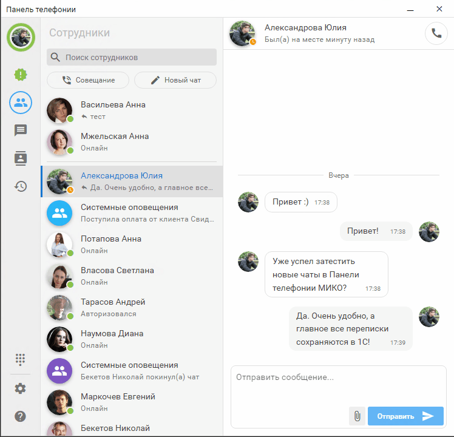

# Панель телефонии для 1С

[Панель телефонии](https://telefon.miko.ru) - это комплексное программное решение объединяющее телефонию и мессенджер
с клиентской базой 1С.

Картинка Максим

Коля на маке обычное разрешение

Коля на маке в режиме HiResolution

---

Набор инструментов, входящих в состав панели телефонии, оптимизирует работу операторов во время
общения с клиентом. Звонок в один клик, отправка сообщений, информация по клиенту при поднятии
трубки и запись разговоров лишь часть доступной функциональности.

 

### Быстрый старт

!!! :zap: [Начать с MikoPBX](../get-started/mikopbx.md) :zap:
Максимальную функциональность при интеграции с офисной АТС MikoPBX.
!!!

!!! :zap: [Начать с FreePBX](../get-started/freepbx.md) :zap:
Интеграция с популярным решение на базе Asterisk.
!!!

!!! :zap: [Начать с Манго Офис](get-started/mango.md) :zap:
Настройка интеграции между 1С:Предпритие и виртуальной АТС от Манго.
!!!

 

### Руководство пользователя

!!!secondary [Панель телефонии](../user-guides/panel/index.md)
Узнайте, как можно настроить панель телефонии под себя, управлять звонками и отправлять сообщения
!!!

!!!secondary [Мессенджер](../user-guides/messenger/index.md)
Настройка приложения для приема и обработки сообщений из WhatsApp
!!!

!!!secondary [Журнал звонков](../user-guides/journal/index.md)
Прослушивание записей разговоров и анализ звонков по всех организации
!!!

!!!secondary [Маршрутизация звонков](../user-guides/routing/index.md)
Настройка модуля умной маршрутизации для автоматического определения ответственных сотрудников
!!!

 

### Остались вопросы?

Проверьте, нет ли ответа в разделе [FAQ](../faq.md).
Свяжитесь с [отделом технической поддержки](https://telefon.miko.ru/contacts/).
Посмотрите [наши вебинары](https://telefon.miko.ru/events/playback/) 
или задайте свой вопрос на [форуме](https://telefon.miko.ru/forum/).
